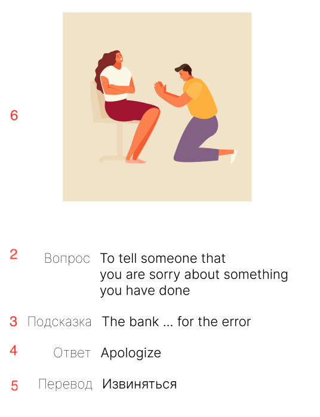
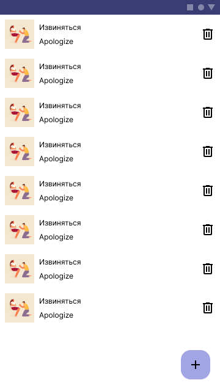
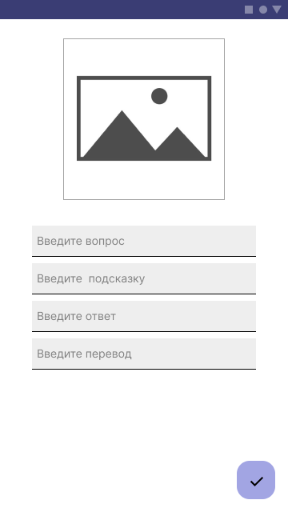
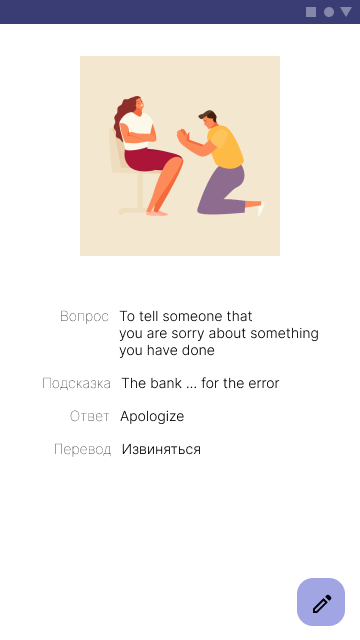
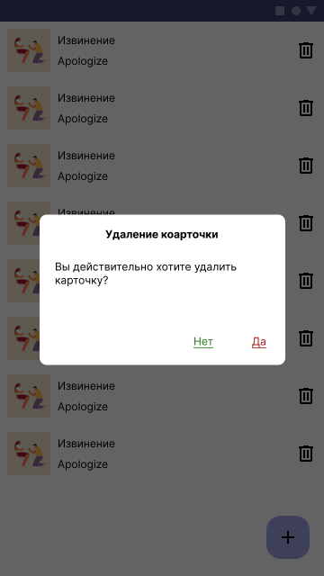

# Лабораторная работа №4. "Списки. ListView,Spiner,RecyclerView"

## Создание базового проекта

1. Выполните fork репозитория https://github.com/chebotarevsa/mad-2023-lab04
2. Выполните клонирование своего репозитория на локальную машину
3. Создайте новый проект в Android Studio типа "Empty Views Activity",
   в качестве цели проекта укажите директорию куда было произведено клонирование

## Приложение "Anki Light"

Приложение представляет собой упрощенный аналог opensource
программы [Anki](https://apps.ankiweb.net/)
предназначенной для изучения новых слов с
помощью [метода интервальных повторений](https://habr.com/ru/companies/puzzleenglish/articles/408921/).
Данный метод широко используется при изучении иностранных языков. Для каждого слова которое
необходимо изучить создается карточка, карточки объединяются в колоды.
Слово повторяется через различные интервалы в зависимости от усвоения.

В данной лабораторной работе необходимо реализовать функционал для ведения колоды карточек для
изучения английских слов. Приложение состоит из трех экранов:

1. Список карточек
2. Просмотр карточки
3. Ведение карточки (создание или изменение)

Приложение должно поддерживать русскую и английскую локаль.
Все экраны должны переживать смену конфигурации (например поворот, измение локализации)

Макет приложения в формате Figma доступен по
следующей [ссылке](https://www.figma.com/file/FQFEOn3g0PUbEJ2w4L87cB/Labs?type=design&node-id=32%3A2&mode=design&t=jSa86bsxctk1cXid-1).

В качестве источника слов, определений и примеров рекомендуется
использовать [Cambridge Dictionary](https://dictionary.cambridge.org/).

## Модель данных

Карточка термина (слова) должна включать следующие поля.

1. Уникальный идентификатор (Id)
2. Определение слова или вопрос (Question)
3. Пример или подсказка (Example)
4. Ответ (Answer)
5. Перевод (Translate)
6. Изображение (Image)

Например



Карточку рекомендуется
моделировать [Data class](https://kotlinlang.org/docs/data-classes.html) Kotlin

Для моделирования колоды может быть использована любая коллекция на ваше усмотрение.

## 1-й Экран "Список карточек"

Первый экран представляет собой список карточек. Для реализации списка необходимо использовать
элемент RecyclerView. Дополнительная реализация списка с помощью ListView будет плюсом. 
Каждый элемент списка содержит следующие поля:

1. Ответ (Answer)
2. Перевод (Translate)
3. Миниатюра изображения (Thumbnail)

При клике на элемент списка необходимо осуществлять переход к экрану "Просмотр карточки".
Для перехода к экрану необходимо использовать явный Intent,
данные карточки необходимо передавать в Extra параметрах Intent.

При клике на кнопку "Добавить" необходимо выполнить к переход к экрану "Ведение карточки".
Для перехода к экрану необходимо использовать явный Intent, для получения результата
необходимо использовать методы Activity: startActivityForResult(устарел) или
registerForActivityResult(актуально).



## 2-й Экран "Ведение карточки"

Для редактирования доступны все поля карточки кроме Id, он должен быть сгенерирован автоматически.
При клике не изображение происходит переход к стандартному приложению "Галерея" (необходимо
использовать неявный Intent или
контракт [GetContent](https://developer.android.com/training/basics/intents/result)),
где пользователь может выбрать необходимое изображение.

При клике на кнопку "Сохранить" проверяется заполнение всех полей и   
осуществляется переход к экрану "Список карточек", где в список добавляется новый элемента.



## 3-й Экран "Просмотр карточки"

На экране просмотра отображаются все поля карточки (кроме Id).

При клике на кнопку "Редактировать" осуществляется переход к экрану ведения карточки.
Подумайте каким образом можно сохранить изменения, если модель данных доступна
только для экрана "Список карточек"

В случае, если при получении изображения возникает ошибка связанная с нехваткой полномочий (permission), используйте следующий код:
``` kotlin
val flag = Intent.FLAG_GRANT_READ_URI_PERMISSION
context.contentResolver.takePersistableUriPermission(uri, flag)
```
[см. документацию](https://developer.android.com/training/data-storage/shared/photopicker)



## Удаление карточки

Удаление карточки производиться по клику на иконку "Удалить".

Будет плюсом если в приложение будет реализован диалог подтверждения удаления.
Например в таком виде



Также будет полюсом если в приложении будет реализовано удаление элемента списка с использованием "свайпа"

## Сдача работы
Срок сдачи работы до 15.11.2023
1. Заполните отчет [REPORT.md](REPORT.md)
2. Выполните commit для фиксации всех изменений
3. Выполнить push для оправки изменений на github.com
4. Создайте Pull Request в репозиторий chebotarevsa/mad-2023-lab04.
   В названии Pull Request укажите группу и свою имя и фамилию, например "123 Иван Иванов"

## Дополнительные материалы

+ [Получение результата из Activity](https://metanit.com/java/android/2.11.php)
+ [Get a result from an activity](https://developer.android.com/training/basics/intents/result)
+ [RecyclerView для начинающего Android-разработчика](https://habr.com/ru/articles/705064/)
+ [Dialogs](https://developer.android.com/develop/ui/views/components/dialogs)


 


